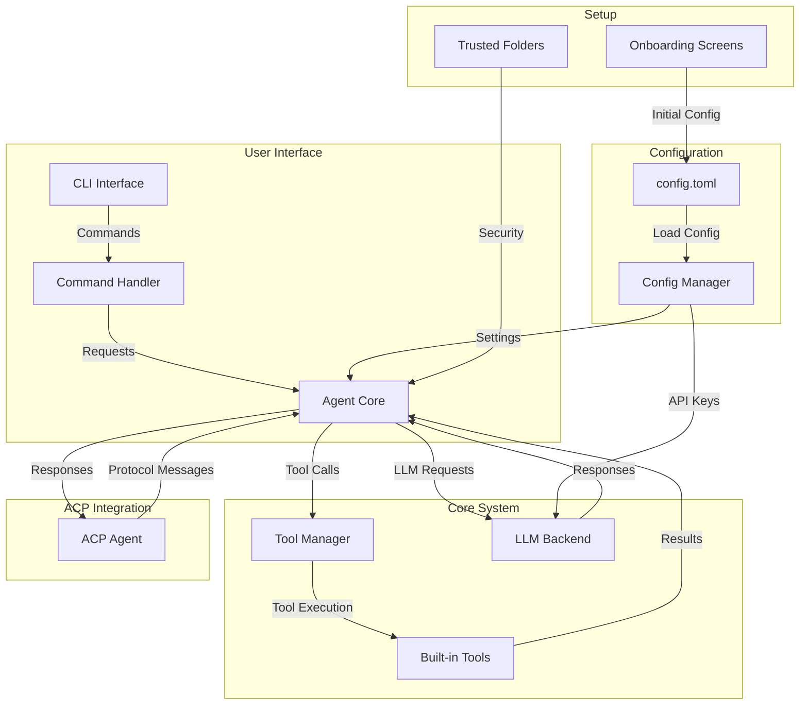

# Mistral Vibe Architecture Overview

## Project Structure

Mistral Vibe is organized into several key components, each with a specific responsibility in the system. The main directories are:

```
vibe/ - Main source code
├── acp/ - Agent Code Processor integration
├── cli/ - Command-line interface components
├── core/ - Core functionality and business logic
└── setup/ - Initial setup and configuration
```

## Core Components

### 1. Core Functionality (`vibe/core/`)

The core module contains the main business logic and components:

- **`agent.py`**: The main agent class that orchestrates interactions between the user, LLM models, and tools.
- **`config.py`**: Configuration management, including API keys, settings, and environment variables.
- **`tools/`**: Tool management system with various built-in tools for file operations, shell commands, etc.
- **`llm/`**: Language model backend integration and formatting.
- **`skills/`**: Skill management for different types of tasks.
- **`prompts/`**: System prompts and conversation templates.
- **`middleware.py`**: Middleware pipeline for request/response processing.

### 2. Command-Line Interface (`vibe/cli/`)

The CLI module handles user interaction:

- **`cli.py`**: Main CLI logic and argument parsing.
- **`entrypoint.py`**: Entry point for the `vibe` command.
- **`textual_ui/`**: Text-based user interface components using Textual.
- **`autocompletion/`**: Autocompletion functionality for commands and file paths.

### 3. Agent Code Processor (`vibe/acp/`)

The ACP module provides integration with the Agent Client Protocol:

- **`acp_agent.py`**: Main ACP agent implementation that handles protocol messages.
- **`tools/`**: ACP-specific tool implementations.
- **`entrypoint.py`**: Entry point for the `vibe-acp` command.

### 4. Setup (`vibe/setup/`)

Setup and onboarding functionality:

- **`onboarding/`**: Initial setup screens and configuration.
- **`trusted_folders/`**: Folder trust management for security.

## Key Files

### Entry Points

- **`vibe/cli/entrypoint.py`**: Main CLI entry point (`vibe` command)
- **`vibe/acp/entrypoint.py`**: ACP entry point (`vibe-acp` command)

### Configuration

- **`pyproject.toml`**: Project metadata, dependencies, and build configuration
- **`vibe/core/config.py`**: Runtime configuration management

### Main Components

- **`vibe/core/agent.py`**: Core agent logic and state management
- **`vibe/acp/acp_agent.py`**: ACP protocol handler
- **`vibe/cli/cli.py`**: CLI command processing

## Architecture Diagram



## Key Features

1. **Modular Tool System**: Tools are implemented as plugins that can be enabled/disabled
2. **Middleware Pipeline**: Requests pass through a chain of middleware for processing
3. **ACP Integration**: Supports the Agent Client Protocol for external integrations
4. **Configurable**: Extensive configuration options via `config.toml`
5. **Security**: Folder trust system to prevent unauthorized operations
6. **Modern CLI**: Rich text UI with autocompletion and command history

## Technology Stack

- **Python 3.12+**: Core programming language
- **Pydantic**: Data validation and settings management
- **Textual**: Terminal UI framework
- **Agent Client Protocol**: External integration protocol
- **Mistral AI Models**: Language model backend
- **Ruff/Pyright**: Code quality and type checking

## Installation and Execution

The project provides two main entry points:

1. **`vibe`**: Main CLI interface for interactive use
2. **`vibe-acp`**: ACP server for external integrations

Both are configured in `pyproject.toml` under `[project.scripts]`.