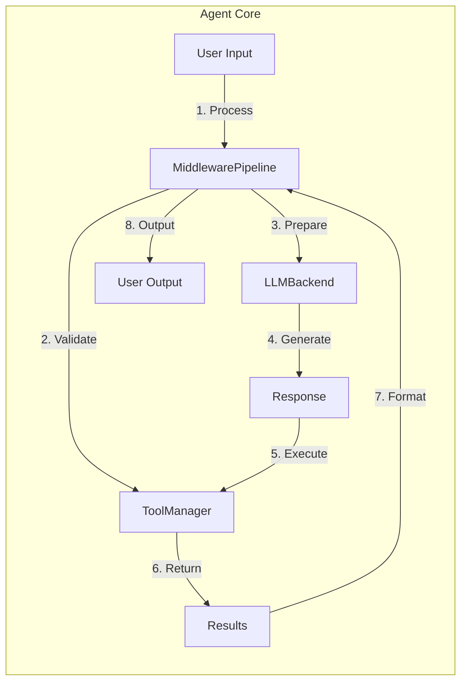
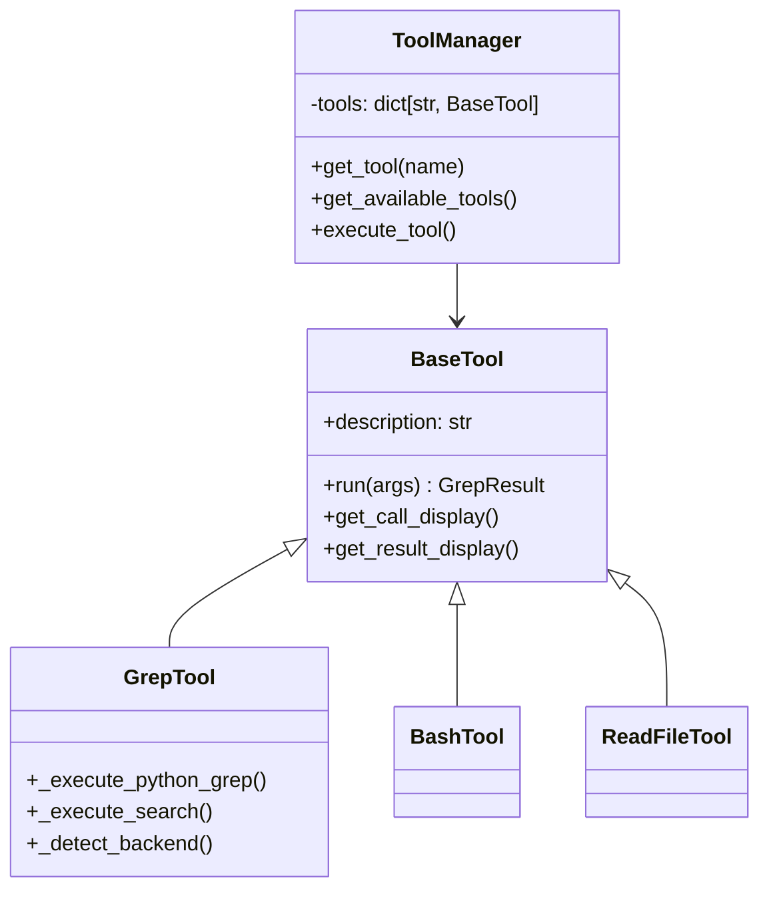
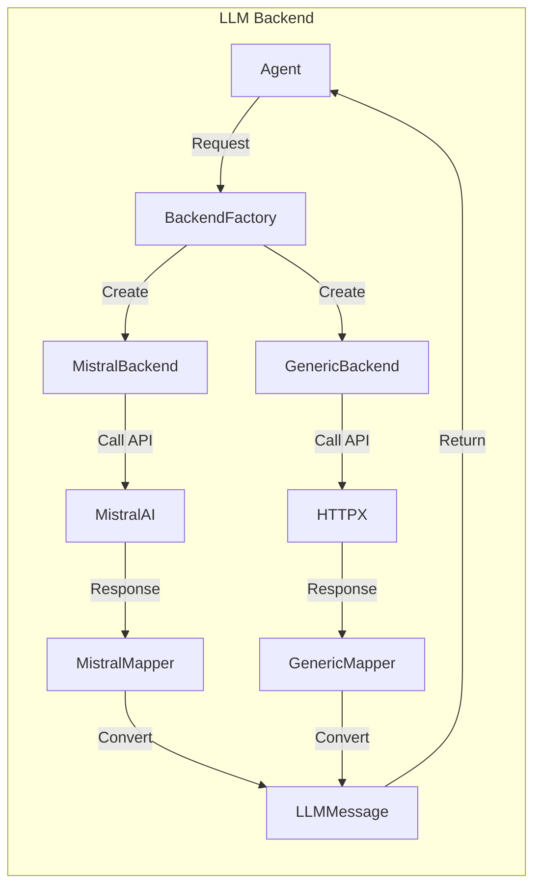
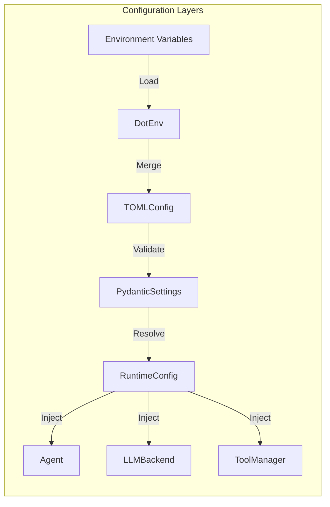
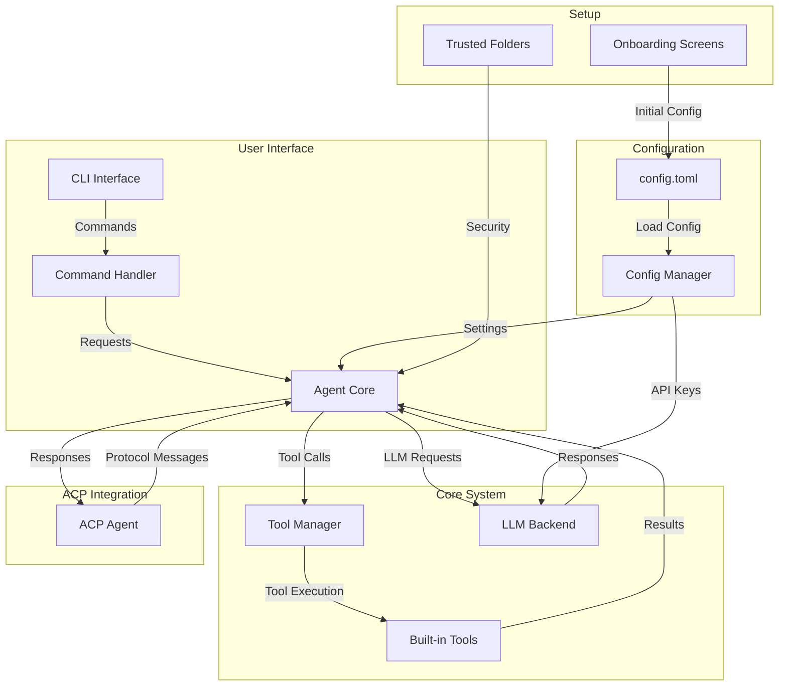

# Mistral Vibe Architecture Overview

## Project Structure

Mistral Vibe is organized into several key components, each with a specific responsibility in the system. The main directories are:

```
vibe/ - Main source code
├── acp/ - Agent Code Processor integration
├── cli/ - Command-line interface components
├── core/ - Core functionality and business logic
└── setup/ - Initial setup and configuration
```

## Core Components

### 1. Core Functionality (`vibe/core/`)

The core module contains the main business logic and components:

- **`agent.py`**: The main agent class that orchestrates interactions between the user, LLM models, and tools.
- **`config.py`**: Configuration management, including API keys, settings, and environment variables.
- **`tools/`**: Tool management system with various built-in tools for file operations, shell commands, etc.
- **`llm/`**: Language model backend integration and formatting.
- **`skills/`**: Skill management for different types of tasks.
- **`prompts/`**: System prompts and conversation templates.
- **`middleware.py`**: Middleware pipeline for request/response processing.

### 2. Command-Line Interface (`vibe/cli/`)

The CLI module handles user interaction:

- **`cli.py`**: Main CLI logic and argument parsing.
- **`entrypoint.py`**: Entry point for the `vibe` command.
- **`textual_ui/`**: Text-based user interface components using Textual.
- **`autocompletion/`**: Autocompletion functionality for commands and file paths.

### 3. Agent Code Processor (`vibe/acp/`)

The ACP module provides integration with the Agent Client Protocol:

- **`acp_agent.py`**: Main ACP agent implementation that handles protocol messages.
- **`tools/`**: ACP-specific tool implementations.
- **`entrypoint.py`**: Entry point for the `vibe-acp` command.

### 4. Setup (`vibe/setup/`)

Setup and onboarding functionality:

- **`onboarding/`**: Initial setup screens and configuration.
- **`trusted_folders/`**: Folder trust management for security.

## Deep Dive: Core Architecture

### Agent System

The agent system is the heart of Mistral Vibe, implementing a sophisticated conversation pipeline:



**Key Components:**
- **Middleware Pipeline**: Chain of processors that validate, transform, and monitor conversations
- **Tool Manager**: Handles tool discovery, permission checking, and execution
- **LLM Backend**: Abstract interface to language models with multiple provider support
- **State Management**: Tracks conversation history, statistics, and session data

### Middleware Pipeline

The middleware system implements a chain-of-responsibility pattern with the following middleware components:

1. **TurnLimitMiddleware**: Enforces maximum conversation turns
2. **PriceLimitMiddleware**: Monitors and limits API costs
3. **PlanModeMiddleware**: Handles different agent modes (default, compact, etc.)
4. **ContextWarningMiddleware**: Validates conversation context
5. **AutoCompactMiddleware**: Automatically compacts long conversations

Each middleware implements the `ConversationMiddleware` protocol with `before_turn()` and `after_turn()` methods.

### Tool System Architecture



**Key Features:**
- **Multi-backend support**: Tools can have multiple implementations (e.g., ripgrep, GNU grep, Python fallback)
- **Permission system**: Three-tier permission model (ALWAYS, ASK, NEVER)
- **State management**: Each tool maintains its own state
- **UI integration**: Tools provide display methods for CLI/ACP interfaces

### LLM Backend System



**Backend Features:**
- **Provider abstraction**: Unified interface for different LLM providers
- **Message mapping**: Converts between internal and provider-specific message formats
- **Streaming support**: Handles both streaming and non-streaming responses
- **Error handling**: Comprehensive error handling and retry logic

### Configuration System

The configuration system uses a layered approach:



**Configuration Features:**
- **Multi-source**: Combines environment variables, .env files, and TOML configuration
- **Type-safe**: Uses Pydantic for validation and type safety
- **Dynamic**: Supports runtime configuration changes
- **Hierarchical**: Nested configuration with sensible defaults

## Key Files

### Entry Points

- **`vibe/cli/entrypoint.py`**: Main CLI entry point (`vibe` command)
- **`vibe/acp/entrypoint.py`**: ACP entry point (`vibe-acp` command)

### Configuration

- **`pyproject.toml`**: Project metadata, dependencies, and build configuration
- **`vibe/core/config.py`**: Runtime configuration management

### Main Components

- **`vibe/core/agent.py`**: Core agent logic and state management
- **`vibe/acp/acp_agent.py`**: ACP protocol handler
- **`vibe/cli/cli.py`**: CLI command processing

## Architecture Diagram



## Key Features

1. **Modular Tool System**: Tools are implemented as plugins that can be enabled/disabled
2. **Middleware Pipeline**: Requests pass through a chain of middleware for processing
3. **ACP Integration**: Supports the Agent Client Protocol for external integrations
4. **Configurable**: Extensive configuration options via `config.toml`
5. **Security**: Folder trust system to prevent unauthorized operations
6. **Modern CLI**: Rich text UI with autocompletion and command history
7. **Cross-platform**: Windows, macOS, and Linux support with appropriate fallbacks
8. **Multi-backend**: Tools support multiple implementations with automatic fallback

## Technology Stack

- **Python 3.12+**: Core programming language
- **Pydantic**: Data validation and settings management
- **Textual**: Terminal UI framework
- **Agent Client Protocol**: External integration protocol
- **Mistral AI Models**: Language model backend
- **Ruff/Pyright**: Code quality and type checking
- **HTTPX**: HTTP client for API communications
- **Pydantic Settings**: Configuration management

## Installation and Execution

The project provides two main entry points:

1. **`vibe`**: Main CLI interface for interactive use
2. **`vibe-acp`**: ACP server for external integrations

Both are configured in `pyproject.toml` under `[project.scripts]`.

## Advanced Features

### Windows Compatibility

The system includes comprehensive Windows support:

- **Python grep fallback**: Full grep functionality without external tools
- **Path handling**: Cross-platform path management using `pathlib`
- **Error handling**: Graceful handling of Windows-specific issues

### Performance Optimization

- **Async I/O**: Asynchronous operations for better responsiveness
- **Caching**: Caching of tool results and configuration
- **Streaming**: Streaming support for large responses
- **Memory management**: Efficient memory usage for long conversations

### Security Features

- **Folder trust system**: Prevents unauthorized file operations
- **Permission system**: Fine-grained control over tool usage
- **Input validation**: Comprehensive validation of all inputs
- **Error isolation**: Sandboxing of tool operations

### Extensibility

- **Plugin architecture**: Easy to add new tools and features
- **Configuration-driven**: Behavior controlled through configuration
- **Event system**: Hooks for custom behavior injection
- **Middleware**: Extensible processing pipeline