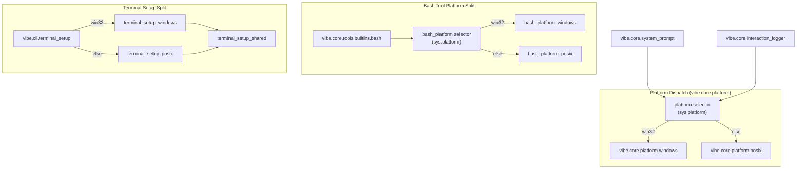

# Windows Platform Separation

This diagram shows how platform-specific modules are split and dispatched at runtime.

Notes:
- Windows and Unix-like implementations live in separate modules.
- Dispatch chooses the module based on sys.platform at runtime.
- Shared modules contain only OS-agnostic code.
